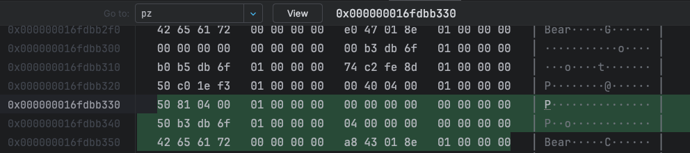
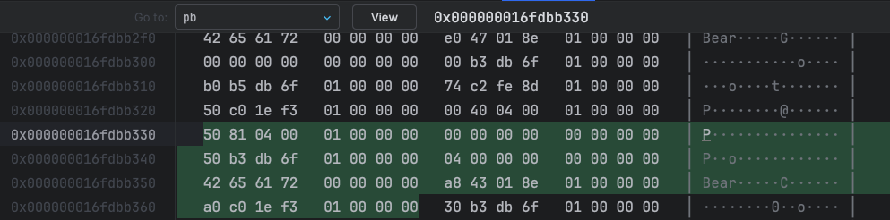

# 🌷 Chapter One：关于对象

> **C++ 的抽象数据类型（Abstract Data Type，ADT）是什么？**

```cpp
// class Point3d
class Point3d {
public:
    Point3d(float x = 0.0, float y = 0.0, float z = 0.0) : _x(x), _y(y), _z(z) {}
    float x() const { return _x; }
    float y() const { return _y; }
    float z() const { return _z; }
private:
    float _x;
    float _y;
    float _z;
};

inline ostream& operator<<(ostream& os, const Point3d &pt){
    os << "(" << pt.x() << ", " << pt.y() << ", " << pt.z() << ")";
    return os;
}
```

Point3d 是一个抽象数据类型，主要体现在：

* **封装性：**&#x7528;户只能通过公开的成员函数（如 `x()`, `y()`, 和 `z()`）访问坐标值，而无法直接操作私有成员变量
* **明确的接口：**&#x50;oint3d 提供了易用的接口（`x()`, `y()`, `z()`），用于访问坐标值。用户不需要知道内部 \_x, \_y, 和 \_z 的存储方式，接口抽象了数据的细节
* **抽象性：**&#x50;oint3d 的设计将 “点” 作为一个抽象的数学概念，通过类封装具体的实现（如使用浮点数表示坐标）

> **将 struct Point3d 转换到 class Point3d 后，会有这样一个疑问：加上了封装之后，布局成本增加了多少？**

**答案是：并没有增加成本**

* 三个 data members 直接内含在每一个 class object 之中，和 C struct 的情况一样
* member functions 虽然含在 class 的声明之中，却不出现在 object 之中。每一个 non-inline member function 只会诞生一个函数实例


C++在布局以及存取时间上的主要的额外负担是由 virtual 引起的，包括：

* **virtual function 机制：**&#x7528;以支持一个有效率的“执行期绑定” （也就是我们熟知的多态）
* **virtual base class ：**&#x7528;以实现“多次出现在继承体系中的 base class，有一个单一而被共享的实例”。（虚继承）


### 1.1 C++ 对象模式

**两种 class data members ：**&#x73;tatic 和 non-static

**三种 class member functions：**&#x73;tatic, non-static, virtual

<mark style="color:blue;">**C++ 对象模型：**</mark>\
<mark style="color:blue;">- non-static data members 被置于每一个 class object 之内</mark>\ <mark style="color:blue;">- static data members 被存放在个别的 class object 之外</mark>\ <mark style="color:blue;">- static 和 non-static function members 也被放在个别的 class object 之外</mark>

这里的 **「存放在个别的 class object 之外」 的意思就是：**&#x4E0D;属于任何单个类对象，而是属于整个类，并且所有该类的对象共享这份静态数据

<mark style="color:blue;">**C++ 对象模型中的 virtual function：**</mark>\
<mark style="color:blue;">- 每一个 class 一堆指向 virtual functions 的指针，放在称为</mark> <mark style="color:blue;"></mark><mark style="color:blue;">**virtual table （vtbl）**</mark><mark style="color:blue;">的表格中</mark>\ <mark style="color:blue;">- 每一个 class object 被安插一个指针，指向相关的 virtual table。这个指针被称为</mark> <mark style="color:blue;"></mark><mark style="color:blue;">**vptr。**</mark><mark style="color:blue;">vptr 的设定和重置都由每一个 class 的 constructor、destructor 和 copy assignment 运算符自动完成。 每一个 class 所关联的</mark> <mark style="color:blue;"></mark>_<mark style="color:blue;">type\_info</mark>_ <mark style="color:blue;"></mark><mark style="color:blue;">object (用以支持 runtime type identification， RTTI) 也经由 virtual table 被指出来，</mark><mark style="color:blue;">**通常放在表格的第一个 slot。**</mark>

<details>

<summary> 什么是 type_info object？</summary>

type\_info object 是 type\_info 类的一个实例，用于描述一个特定的类型。是**运行时类型识别（RTTI, Runtime Type Identification）** 的核心部分

</details>

```cpp
// 1.1
class Point{
public:
    Point(float xval);
    virtual ~Point();

    float x() const;
    static int point_count();

protected:
    virtual ostream& print(ostream& os) const;
    float _x;
    static int _point_count;
};

cout << sizeof(Point) << endl; // 16
```

<figure><figcaption></figcaption></figure>

#### 接下来，加入继承（Adding Inheritance）


### 1.3 对象的差异

C++程序设计模型支持三种 **programming paradigms**

1. **程序模型（procedural model）：**&#x7A0B;序模型是一种以过程为中心的编程范式，强调按步骤执行程序逻辑。程序通过函数（或过程）来实现特定的任务，数据和函数分离


```cpp
char boy[] = "Danny";
char *p_son;

p_son = new char[strlen(boy) + 1];
strcpy(p_son, boy);
cout << "The boy's name is " << boy << endl;
cout << "The son's name is " << p_son << endl;    
```


2. **抽象数据类型模型（abstract data type model, ADT）:**&#x6B64;模型所谓的“抽象”是和一组表达式（public 接口）一起提供的，那时其运算定义仍然隐而未明。

```cpp
string girl = "Lucy";
string daugter;
// string::operator=()
daugter = girl;
cout << "The girl's name is " << girl << endl;
cout << "The daughter's name is " << daugter << endl;
```

3. **面向对象模型（object-oriented model）。**&#x6B64;模型中有一些彼此相关的类型，通过一个抽象的 base class 被封装起来。在抽象数据类型模型的基础上进一步支持 **继承** 和 **多态**。它强调对象之间的关系，通过继承和多态使得代码复用性和可扩展性更高。

C++以下列方法支持多态：

1. 经由一组隐式的转化操作。例如把一个 derived class 指针转化为一个指向其 public base type 的指针

```cpp
shape *ps = new circle();
```

2. 经由 virtual function 机制：

```cpp
ps->rotate();
```

3. 经由 dynamic\_cast 和 typeid 运算符:

```cpp
if(circle *pc = dynamic_cast<circle*>(ps))...
```

> <mark style="background-color:yellow;">**多态的主要用途是经由一个共同的接口来影响类型的封装，这个接口通常被定义在一个抽象的 base class 中。这个共享接口是以 virtual function 机制引发的，它可以在执行期根据 object 真正类型解析出到底是哪一个函数实例被调用。**</mark>


> **现在可以总结：需要多少内存才能够表现一个 class object?**

* non-static data members 的总大小
* 为了满足数据对齐(alignment) 和填补(padding) 上去的空间
* 为了支持 virtual 而由内部产生的任何额外负担

#### :star2: 指针的类型

<mark style="background-color:yellow;">一个指针，不管它指向哪一种数据类型，指针本身所需的内存大小是固定的。</mark>

```cpp
class ZooAnimal {
public:
    ZooAnimal(string name, int loc) : name(name), loc(0) {}
    virtual ~ZooAnimal() {}
    virtual void rotate() {};
protected:
    int loc;
    string name;
};

int main() {
    ZooAnimal za("Zoey", 3);
    ZooAnimal *pza = &za;
    cout << sizeof(pza) << endl; // 8
}
```

> **一个指向 ZooAnimal 的指针是如何地与一个指向整数的指针或一个指向 template Array 的指针有所不同的呢？**

```cpp
ZooAnimal *px;
int *pi;
Array<String> *pta;
```

```cpp
ZooAnimal za("Zoey", 3);
ZooAnimal *pza = &za;
cout << sizeof(pza) << endl; // 8

int a=1;
int *pa = &a;
cout << sizeof(pa) << endl; // 8

char b= 'b';
char *pb = &b;
cout << sizeof(pb) << endl; // 8

void *ptr = nullptr;
cout << sizeof(ptr) << endl; // 8
```

从内存需求的观点来说，没有什么不同！**「指针类型」** 指的是指针所寻址出来的 object 类型不同

在 64 位系统上，内存地址是 64 位长，因此指针的大小是 8 字节。64 位系统的寄存器宽度为 64 位，存储指针时需要与寄存器宽度匹配。

> **不同的是什么？**

**不同的是指针所指的地址所占的大小，比如：**

* `pa` 所指的地址将占4字节
* `pb` 所指的地址将占1字节
* `pza` 所指的地址将占48字节
  * 8 ：4(int) + 4(padding)
  * 32 : string
  * 8: vptr
* `void *` 类型的指针所涵盖的空间，并不知道。<mark style="background-color:red;">**所以 void\* 类型的指针只能勾维持一个地址，而不能够通过它操作所指的 object**</mark>


```cpp
class Base{
public:
    Base(){}
private:
    string name;
};

int main(){
    cout << sizeof(Base) << endl; //32
}
```


#### 加入多态之后（Adding Polymorphism）

```cpp
class ZooAnimal {
public:
    ZooAnimal(string name, int loc) : name(name), loc(0) {}
    virtual ~ZooAnimal() {}
    virtual void rotate() {
        cout << "ZooAnimal rotate" << endl;
    };
protected:
    int loc;
    string name;
};

class Bear :public ZooAnimal {
public:
    Bear() : ZooAnimal("Bear", 1){}
    ~Bear(){};
    void rotate(){
        cout << "Bear rotate" << endl;
    };
    virtual void dance(){};
protected:
    enum Dances{waltz, tango, foxtrot};
    Dances dances_known;
    int cell_block;
};

Bear b;
ZooAnimal *pz= &b;
Bear *pb = &b;
Bear &rb = *pb;
```

> Bear 指针和 ZooAnimal 指针有什么不同？

它们都指向 Bear Object 的第一个 Byte，但是：

* pb 涵盖的地址包含了整个 Bear Object
* pz 涵盖的地址只包含了 Bear Object 中的 ZooAnimal subobject

我们可以看一下内存分布：

<figure><figcaption><p>pz的所占内存为48Bytes（绿色部分）</p></figcaption></figure>

<figure><figcaption><p>pb所占内存为56Bytes（绿色部分）</p></figcaption></figure>

除了ZooAnimal subobject 中出现的 members，你不能够使用pz来直接处理Bear的任何 members。<mark style="background-color:blue;">**唯一的例外是通过 virtual 机制。**</mark>

当我们写：**`pz -> rotate();`**&#x70;z的类型将在**编译时期**决定以下两点：

* 固定的可用接口。即 pz 只能够调用 ZooAnimal 的 public 接口
* 该接口的 access level。（例如，`rotate()`是 ZooAnimal 的一个 public member）

在每一个执行点， pz 所指的 object 类型可以决定 `rotate()` 所调用的实例。类型信息的封装并不是维护于 pz 之中，而是维护于 link 之中，此 link 存在于 object 的 vptr 和 vptr 所指的 virtual table 之间 。

现在看另一种情况：

```cpp
Bear b;
ZooAnimal za = b; // 这会引起切割

// 此时调用的是： ZooAnimal::rotate()
za.rotate();
```

> **为什么 rotate() 所调用的是 ZooAnimal 实例而不是 Bear 实例？**

编译器在初始化及指定操作之间做出了仲裁。编译器必须确保如果某个 object 含有一个或一个以上的 vptrs，那些 vptrs的内容不会被 base class object 初始化或改变。

> **如果初始化函数将一个 object 内存完整拷贝到另一个 object 去，为什么 za 的 vptr 不指向 Bear 的 virtual table？**

一个 pointer 或一个 reference 之所以支持多态，是因为它们并不引发内存中任&#x4F55;**“与类型有关的内存委托操作”**：会受到改变的，只有它们所指向的内存的“大小和内容解释方式”而已。


