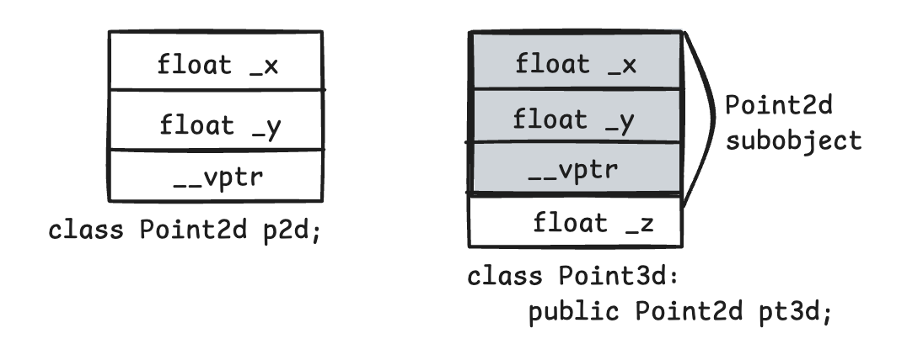

# Chapter 2：构造函数语意学

## 2.1 Default Constructor 的构造操作

> **编译器何时会生成默认构造函数？**

* 对于 class X, **如果没有任何 user-declared constructor, 那么会有一个 default constructor 被隐式（implicitly）声明出来。**
* 一个被隐式声明出来的 default constructor 将是一个 trivial（没啥用的）constructor。
* 如果类中存在用户定义的任何构造函数（无论是否带参数），编译器 **不会** 再生成默认构造函数。

下面分别讨论 nontrivial default constructor 的情况：

#### 1. “带有 Default Constructor” 的 Member Class Object

如果一个class没有任何的构造函数，但是它内含一个 **成员对象（member object），**&#x800C;这个成员对象有 default constructor，那么这个class的implicit default constructor 就是“nontrivial”，编译器需要为该class合成出一个default constructor。<mark style="color:blue;">**不过这个合成操作只有在constructor真正需要被调用时才会发生。**</mark>

> **于是出现了一个有趣的问题：在C++各个不同的编译模块中，编译器如何避免合成出多个 default constructor（比如说一个是为A.C文件合成，另一个是为B.C文件合成）呢？**

我们先来理解这个问题本身。看如下代码


```cpp
#ifndef ANIMAL_H
#define ANIMAL_H

#include <string>
class Animal {
public:
    std::string name; // 成员变量有默认构造函数
};

#endif // ANIMAL_H
```



```cpp
#include "Animal.h"
#include <iostream>

int main() {
    Animal a; // 使用隐式默认构造函数
    std::cout << a.name << std::endl; // `std::string` 默认构造函数被调用
    return 0;
}
```



```cpp
#include "Animal.h"

void createAnimal() {
    Animal b; // 这里也需要隐式默认构造函数
}
```


**编译方式：**

```bash
g++ -c main.cpp -o main.o
g++ -c utils.cpp -o utils.o
g++ main.o utils.o -o app
```

当编译 `main.cpp` 和 `utils.cpp` 时，编译器在每个文件中都会尝试为 Animal 生成一个 隐式默认构造函数，但问题在于：

1\. 如果隐式默认构造函数不是 inline，它会在**每个编译单元**中生成一个完整的非内联定义。

2\. 最终链接时会有两个相同的 `Animal::Animal()` 定义，导致 **重复定义错误。**

**编译器的解决方式：**

解决方法是把合成的 default constructor、copy constructor、destructor、assignment copy operator 都以 inline 方式完成。

* **一个 inline函数有静态链接（static linkage），不会被文件以外者看到。**
* 如果函数太复杂，不适合做成 inline，就会合成出一个 explicit non-inline static 实例。

```cpp
class Foo {
public:
    Foo() {};
    Foo(int i) {};
private:
    int val;
    Foo *pnext;
};

class Bar {
public:
    Foo foo;
    char *str;
};

void foo_bar() {
    Bar bar; // Bar::foo 必须在此处初始化
}
```

被合成的 Bar 的 default constructor 内含必要的代码，能够调用 class Foo 的 default constructor 来处理 member object `Bar::Foo`, 但它并不产生任何代码来初始化 `Bar::str`。

* 将 `Bar::foo` 初始化是编译器的责任
* 将 `Bar::str` 初始化是程序员的责任

被合成的 default constructor 看起来可能是这样的：

```cpp
inline Bar::Bar(){
    // 伪代码
    foo.Foo::Foo();
}
```


注意：**被合成的 default constructor 只满足编译器的需要，而不是程序的需要。**&#x4E3A;了让这个程序片段能够正确执行，字符指针 str 也需要被初始化。


现在，我们假设程序员已经写了构造函数，如下：

```cpp
Bar::Bar(){
    str = 0;
}
```

此时，str 被初始化了，但是编译器还需要初始化 member object foo。但是程序员实现的 constructor 并没有初始化 foo 的操作。此时编译器会怎么做呢？

编译器的行动如下：

<mark style="background-color:blue;">**编译器会扩张已经存在的 constructors, 在其中安插一些代码，使得 user code 执行之前，先调用必要的 default constructors。**</mark>延续前面的例子，扩张后的 constructors 可能是如下的样子：

```cpp
Bar::Bar(){
    foo.Foo::Foo(); // 附加上的 compiler code
    str = 0;        // explicit user code
}
```

> **如果有多个 class member objects 都要求 constructor 初始化操作，将如何？**

C++要求以 member objects 在 class 中的声明顺序来调用各个 constructors。

#### 2. “带有 default constructor” 的Base Class

如果一个**没有任何 constructors 的 class 派生自一个 "带有default constructors" 的 base class**， 那么这个 derived class 的 default constructor 会被视为 nontrivial, 并因此需要被合成出来。它将调用上一层 base classes 的 default constructor 。

#### 3. “带有一个 Virtual Function” 的 Class

另有两种情况，也需要合成出 default constructor:

1. class 声明（或继承）一个 virtual constructor。
2. class 派生自一个继承串链，其中有一个或更多的 virtual base class。

```cpp
class Widget {
public:
    virtual void flip() = 0;
};

class Bell : public Widget {
public:
    void flip() {
        cout << "Ding!" << endl;
    }
};

class Whistle : public Widget {
public:
    void flip() {
        cout << "Ta-da!" << endl;
    }
};

void flip( Widget &weight) {
    weight.flip();
}

void foo() {
    Bell b;
    Whistle w;

    flip(b);
    flip(w);
}

```

为了让这个机制发挥功效，编译器必须为每一个 Widget（或其派生类的）object 的 vptr 设定初值，放置适当的 virtual table地址。

对于 class 所定义的每一个 constructor，编译器会安插一些代码来做这样的事情。

对于那些未声明任何 constructors 的 classes，编译器会为它们合成一个 default constructor， 以便正确地初始化每一个 class object 的 vptr。

#### 4. “带有一个 Virtual Base Class” 的 Class

```cpp
class X{ public: int i;};
class A: public virtual X{public: int j;};
class B: public virtual X{public: double d;};
class C: public A, public B{public: int k;};

void foo(A* pa){
    pa->i = 1024;
}

int main(){
    foo(new A);
    foo(new C);
    return 0;
}
```

使用**虚继承（virtual inheritance）时**，基类的数据成员（例如 `X::i`）的<mark style="background-color:blue;">**内存布局不再是固定的**</mark>。原因在于：

* 虚继承允许多个派生类**共享基类的唯一实例，避免传统继承中的菱形继承问题（重复继承导致多个相同基类的实例）。**
* 为了实现这一点，派生类必须引入一种机制，使得在运行时可以准确地找到虚基类的唯一实例。

A 和 B 都虚继承了 X：这意味着 **X 的成员（如 i）在 C 中只有一个共享实例。**

在 `foo(A* pa)` 中，pa 的动态类型可能是 A\* 或 C\*，这会影响到 pa->i 的实际存取位置

**动态偏移问题：**

由于虚继承，`X::i` 的实际位置在内存中无法在编译期确定：

• 如果 pa 指向 A 的实例，`X::i` 的位置可以直接通过 A 中的虚继承指针找到。

• 如果 pa 指向 C 的实例，`X::i` 的位置需要通过 C 中指向 X 的虚继承表（vtable）中的指针找到。

因此，编译器需要一种机制来在运行时定位虚基类的成员 `X::i`

`foo()` 可以被改写如下：

```cpp
void foo(A * pa){
    pa->_vbcX->i = 1024;
}
```

`_vbcX` 表示编译器所产生的指针，指向 virtual base class X。

`_vbcX`（或编译器所做出的某个什么东西）是在 class object 构造期间被完成的。对于 class 所定义的每一个 constructor，**编译器会安插那些“允许每一个 virtual base class 的执行期存取操作”的代码**。如果 class 没有声明任何 constructors，编译器必须它合成一个 default constructor。


**C++新手一般有两个常见的误解：**

1. 任何 class 如果没有定义 default constructor，就会被合成出一个来。
2. 编译器合成出来的 default constructor 会显式设定 “class 内每一个 data member 的默认值”。


&#x20;如你所见，没有一个是真的！

***

## 2.2 Copy Constructor 的构造操作

有三种情况，会以一个 object 的内容作为另一个 class object 的初值。



### 显式地以一个 object 的内容作为另一个 class object 的初值

```cpp
Class X{...};
X x_1;
X x_2 = x_1;
```



### object 作为参数传递给某个函数时

```cpp
extern void foo(X x);
void bar(){
    X xx;
    foo(xx);
}
```



### 当函数返回一个 class object 时

```cpp
X foo_bar(){
    X xx;
    return xx;
}
```



### default memberwise Initialization

**如果 class 没有提供一个 explicit copy constructor 又当如何？**

当 class object 以“相同 class 的另一个 object”作为初值，其内部是以所谓的 default memberwise initialization 手法完成的，也就是把每一个内建的或派生的 data member（例如一个指针或一个数组）的值，从某个 object 拷贝一份到另一个 object 身上。

<mark style="background-color:blue;">**不过它并不会拷贝其中的 member class object，而是以递归的方式施行 memberwise initialization。**</mark>例如，考虑下面这个 class 声明：

```cpp
class Word{
private:
    int _occurs;
    String _word;
};
```

Word object 的 default memberwise Initialization 的方式如下：

1. 拷贝 member `_occurs`。
2. 在 String 类型的 member object `_word` 身上递归实施 memberwise Initialization。


Default constructors 和 copy constructors 在必要的时候才会由编译器产生出来


**决定一个 copy constructors 是否为 trivial 的标准在于 class 是否展现出所谓的 "bitwise copy semantics"。**

### Bitwise Copy Semantics(位逐次拷贝)

```cpp
class Word{
public:
    Word(const char * s):str(new char[strlen(s)+1]){
        strcpy(str,s);
        cnt = 1;
    }
    ~Word(){
        delete [] str;
    }
private:
    int cnt;
    char * str;
};
```

**这段代码展现了 bitwise copy semantics。**

此时，编译器就不会为我们产生 Default constructors 和 copy constructors&#x20;

这时候，这种 bitwise copy 构造的类就会存在一个问题，就是**对于指针变量来说，源类中的指针变量保存的是开辟的空间，而目标类中的的指针变量，是通过逐位复制的方式得到的，这样， 目标类中的指针变量保存的地址和源类的是一样的。**&#x5F53;源类释放空间之后，目标类中的指针变量指的是一堆无意义的空间，这样，当目标类中的指针变量再释放空间的时候，就会报错。

但是，如果 class Word 的声明是下面这种情况

```cpp
class String {
public:
    String(const char *);
    String(const String &);
    ~String();
};

class Word {
public:
    Word(const String &s) : str(s), cnt(1) {}
    ~Word();
private:
    int cnt;
    String str;
};
```

这种情况下，并没有展现出 bitwise copy semantics。

这种情况下，编译器必须合成出一个 copy constructor, 以便调用member class String object 的 copy constructo。

```cpp
inline Word::Word(const Word& wd){
    str.String::String(wd.str);
    cnt = wd.cnt;
}
```


有一点很值得注意：被合成出来的 copy contructor 中，如整数，指针，数组等等的 nonclass members 也都会被复制。


### 不要 Bitwise Copy Semantics!

有4种情况，**class 不会展现出 bitwise copy semantics**

1. 当 class 内含一个 member object 而后者的 class 声明有一个 copy constructor时（不论是被class 设计者显式地声明，就像前面的String 那样；或是被编译器合成，像 class Word 那样）。
2. 当 class 继承自一个 base class 而后者存在一个 copy constructor 时（再次强调，不论是被显式声明或是被合成而得）。
3. 当 class 声明了一个或多个 virtual functions 时。
4. 当 class 派生自一个继承串链，其中有一个或多个 virtual base classes 时。&#x20;

在前两种情况中，编译器必须将 member 或 base class 的 “copy constructors 调用操作” 安插到被合成的 copy constructor 中。**前一节 class Word的 “合成而得的copy constructor” 正足以说明情况1。**

情况3和4有点复杂，接下来讨论。

### 重新设定 Virtual Table 的指针

只要有一个 class 声明了一个或者多个 virtual function, 就会有下面的操作：

* 增加一个 virtual function table(vtbl), 内含每一个有作用的 virtual function 的地址
* 一个指向 virtual function table 的指针(vptr)，安插在每一个 class object 内

```cpp
class ZooAnimal {
public:
    ZooAnimal() {};
    virtual ~ZooAnimal() {};
    virtual void animate();
    virtual void draw();
private:
    // ZooAnimal 的 animate() 和 draw() 函数所需要的数据
};

class Bear : public ZooAnimal {
public:
    Bear() {};
    ~Bear() {};
    void animate();
    void draw();
    virtual void dance();
private:
    // Bear 的 animate() 和 draw() 和 dance() 函数所需要的数据
};

```

```cpp
Bear yogi;
Bear winnie = yogi;
```

yogi 会被 default Bear constructor 初始化。而在 constructor 中，yogi 的 vptr 被设定指向 Bear class 的 virtual table（靠编译器安插的代码完成）。因此，把yogi的 vptr 值拷贝给 winnie 的 vptr 是安全的。

<figure><figcaption><p>yogi 和 winnie 的关系</p></figcaption></figure>

当一个 base class object 以其 derived class 的 object 内容做初始化操作时，其 vptr 复制操作也必须保证安全，例如：

```cpp
ZooAnimal franny = yogi; // 这里会发生切割行为
```

franny 的 vptr 不可以被设定指向 Bear class 的 virtual table（但如果 yogi 的 vtpr 被直接 "bitwise copy" 的话，就会导致此结果），否则当下面程序片段中的 draw() 被调用而 franny 被传进去时，就会“炸毁”:

```cpp
void draw(const ZooAnimal& zoey){
    zoey.draw();
}

void foo(){
    // franny 的 vptr 指向 ZooAnimal 的 virtual table,
    // 而非 Bear 的 virtual table.
    ZooAnimal franny = yogi;
    draw(yogi);   // 调用 Bear::draw();
    draw(franny); // 调用 ZooAnimal::draw();
}
```

<figure><figcaption></figcaption></figure>

通过 franny 调用 virtual function `draw()`，调用的是 ZooAnimal 实例而非 Bear 实例（甚至虽然 franny是以 Bear object yogi 作为初值），因为 franny 是一个 ZooAnimal object。

事实上，yogi 中的Bear 部分已经在 franny初始化时被切割（sliced）掉了。如果 franny被声明为一个reference（或如果它是一个指针，而其值为yogi 的地址），那么经由 franny 所调用的 draw0才会是 Bear 的函数实例。

<mark style="background-color:blue;">**也就是说，合成出来的 ZooAnimal copy constructor 会显式设定 obejct 的 vptr 指向 ZooAnimal class 的 virtual table。而不是直接从右边的 class object 中将其 vptr 现值拷贝过来**</mark>

### 处理 Virtual Base Class Subobject

```cpp
class ZooAnimal {
public:
    ZooAnimal() {};
    virtual ~ZooAnimal() {};
    virtual void animate();
    virtual void draw();
private:
    // ZooAnimal 的 animate() 和 draw() 函数所需要的数据
};

class Raccoon: public virtual ZooAnimal{
public:
    Raccoon() {};
    Raccoon(int x) {};
};
```

这段代码中，ZooAnimal 成为 Raccoon 的一个 virtual base class

***

## 2.3 程序转化语意学

### 显式的初始化操作(Explict Initialization)

已知有这样的定义：`X x0;`

下面的三个定义，每一个都明显地以 `x0` 来初始化其 class object:

```cpp
void foo_bar(){
    X x1(x0);        // 直接初始化
    X x2 = x0;       // 拷贝初始化
    X x3 = X(x0);    // 拷贝初始化，先构造一个临时对象，再拷贝到 x3
}
```

必要的程序转化有两个阶段：[^1]

1. 重写每一个定义，**其中的初始化操作会被剥除。**（译注：这里所谓的“定义”是指上述的x1，×2，×3三行；在严谨的C++用词中，<mark style="background-color:blue;">**“定义”是指“占用内存”的行为。）**</mark>
2. class 的 copy constructor 调用操作会被安插进去。

这三种写法看起来不同，但它们的共同点是：都使用 x0 来初始化对象，最终都需要调用 拷贝构造函数。

**编译器的任务是将它们“转换为明确的操作”，即显式地插入对拷贝构造函数的调用。**

> **「剥除初始化操作」 如何理解？**

在这个阶段，编译器会去掉初始化的表面语法（如括号或赋值符号），并将其理解为对应的构造函数调用

一旦完成了初始化操作的“剥除”，编译器会明确插入对 拷贝构造函数 的调用，以便真正实现对象的初始化

所以，经过上面两个步骤的初始化之后， `foo_bar()` 可能看起来如下：

```cpp
void foo_bar(){
    X x1;
    X x2;
    X x3;
    
    // 编译器安插 X copy construction 的调用操作
    x1.X::X(x0);
    x2.X::X(x0);
    x3.X::X(x0);
}
```

其中的 `x1.X::X(x0);` 就表现出对以下的 copy constructor 的调用：

```cpp
X::X(const X& xx);
```

### 参数的初始化(Argument Initialization)

C++ Standard ：把一个 class object 当作参数传给一个函数（或是作为一个函数的返回值），相当于以下形式的初始化操作：

```cpp
X xx = arg;
```

其中 `xx` 代表形式参数（或返回值）， `arg` 代表真正的参数值。

```cpp
void foo(X x0);
X xx;
foo(xx);
```

那么这种调用方式，将会要求局部实例 `x0` 以 memberwise 的方式将 `xx` 当作初值。&#x20;

编译器的一种实现策略是导入所谓的临时性 object，并调用 copy constructor 将它初始化，然后将此临时性 object 交给函数，转化如下：

```cpp
X _temp0;
_temp0.X::X(xx);
foo(_temp0);
```

### 返回值的初始化(Return Value Initialization)

```cpp
X bar(){
    X xx;
    return xx;
}
```

转化如下：

1. 首先加上一个额外参数，类型是 class object 的一个 reference, 这个参数将用来放置被“拷贝构建”而得到的返回值
2. 在 return 指令之前安插一个 copy constructor 调用操作，以便将欲传回的 object 的内容当作上述新增参数的初值

```cpp
void bar(X & _result){
    X xx;
    
    // 编译所产生的 default constructor 调用操作
    xx.X::X();
    
    // 编译所产生的 copy constructor 调用操作
    _result.X::XX(xx);
    
    return;
}
```

### Copy Constructor : 要还是不要？

```cpp
class Point3d{
public:
    Point3d(float x, float y, float z);
private:
    float _x,_y,_z;
}
```

这个 class 的 default copy constructor 被视为 trivial。

它没有任何 member class object 带有 copy constructor, 也没有任何的 virtual base class 或者 virtual function。所以，默认情况下，一个 Point3d class object 的 memberwise 初始化操作会导致 bitwise copy。并且是安全的。

## 2.4 成员们的初始化队伍(Member Initialization List)

**必须使用 member initialization list 的4种情况：**

* 当初始化一个 reference member 时
* 当初始化一个 const member 时
* 当调用一个 base class 的 constructor，而它拥有一组参数时
* 当调用一个 member class 的 constructor, 而它拥有一组参数时

```cpp
class Word{
    String _name;
    int _cnt;
public:
    Word(){
        _name = 0;
        _cnt = 0;
    }
}
```

扩张方式如下：

```cpp
Word::Word(){
    _name.String::String();  // 调用 String 的 default constructor
    String temp = String(0); // 产生临时性对象
    _name.String::operator=(temp); // memberwise 拷贝 _name
    temp.String::~String();  // 摧毁临时对象
    
    _cnt = 0;
}
```

更有效率的一种方式：

```cpp
// 较好的方式
Word::Word:_name(0){
    _cnt = 0;
}
```

编译器扩张如下：

```cpp
Word::Word(){
    // 调用 String(int) constructor
    _name.String::String(0);
    _cnt = 0;
}
```


initialization list 种的顺序是由 class 中的 members 声明顺序决定的


```cpp
class X{
    int i;
    int j;
public:
    X(int val):j(val),i(j){}
};
```

上述程序代码看起来像是**要把 j 设初值为 val，再把 i 设初值为 j。**

问题在于，由于声明顺序的缘故，initialization list 中的 `i(j)` 其实比 `j(val)` 更早执行。但因为 `j` 一开始未有初值，所以 `i(j)` 的执行结果导致 `i` 无法预知其值。


目前可以对此问题做出警告的编译器好像只有 g++？（GNU C++编译器）


```cpp
X::X(int val):j(val){
    i = j;
}
```

> j 的初始化被安排在 explicit user assignment 之前还是之后呢？

**initialization list 的项目被安放在 explicit user code 之前**


[^1]: 当用类似 X x1(x0); 或 X x2 = x0; 这样的语法初始化对象时，编译器会对代码进行必要的程序转换（program transformation），其目的是将这些初始化操作重新解释为对 拷贝构造函数（copy constructor） 的显式调用
