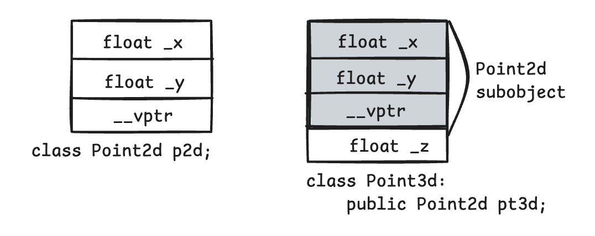

# 内存探索

#### 代码环境

* macOS Sequoia&#x20;
* Clion + g++-14 (Homebrew GCC 14.2.0\_1) 14.2.0&#x20;

***

### 简单对象内存布局

```cpp
class Basic {
public:
    int a;
    double b;
};

int main() {
    Basic temp;
    temp.a = 10;
    return 0;
}
```

我们使用 lldb 查看对象内存布局

```cpp
(lldb) p &temp
(Basic *) 0x000000016fdff150

(lldb) p &temp.a
(int *) 0x000000016fdff150

(lldb) p &temp.b
(double *) 0x000000016fdff158
```

**对象 temp 的起始地址** 和 **成员变量 a 的地址**一样，都是：`0x000000016fdff150`

表明 int a 是对象 temp 中的第一个成员，位于对象的起始地址

成员变量 b 的类型为 double，其地址是 `0x000000016fdff158` （a的地址+8）

<figure><figcaption><p>temp 的内存布局</p></figcaption></figure>

### access 对于对象布局的影响

```cpp
class Concrete1{
public:
    int val;
    char bit1;
};

class Concrete2: public Concrete1{
public:
    char bit2, bit3, bit4;
};

class Con1{
private:
    int val;
    char bit1;
};

class Con2: public Con1{
private:
    char bit2, bit3, bit4;
};
int main(){
    Concrete2 tmp;
    Con2 tmp2;
    cout << sizeof(tmp) << endl;  // 12
    cout << sizeof(tmp2) << endl; // 8
}
```

Concrete1, Concrete2 和 Con1, Con2 的成员都是一样的，只是访问控制不同。一个为 public，另一个为 private。

* 因为 Concrete1 的成员是 public，派生类和外部代码可以直接访问这些成员，因此编译器不会对这些成员的位置或大小进行额外优化。
* 对于 Con2，基类的 private 成员不可直接访问，编译器可以将这些成员与派生类的成员混合排列，复用补齐空间，从而减少对象大小。


